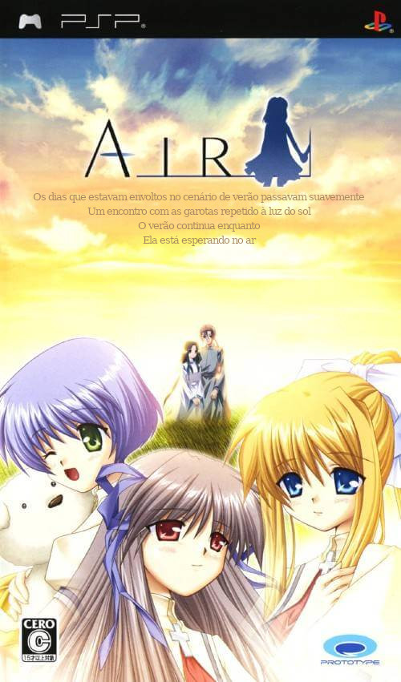

---
circles:
  - kikachan-games
  - taiyaki-club
platforms:
  - pc
  - android
  - psp
date: 2025-01-01
status: complete
origin: en
subs: full
graphics: full
dub: na
credits:
  - author: ashuramage
    roles:
      - role: video-editing
  - author: ceuipsolon
    roles:
      - role: special-thanks
      - role: graphics-editing
  - circle: converting-minds-vnx
    roles:
      - role: special-thanks
  - circle: taiyaki-club
    roles:
      - role: special-thanks
  - author: hinrong
    roles:
      - role: qc
      - role: modding
      - role: proofreading
  - author: manolo-chan
    roles:
      - role: director
      - role: graphics-editing
      - role: programming
      - role: support
      - role: tools
      - role: translation
  - author: 0mateus
    roles:
      - role: graphics-editing
      - role: modding
      - role: proofreading
      - role: qc
  - author: div-lu
    roles:
      - role: graphics-editing
      - role: translation
downloads:
  - platform: pc
    provider: "GitHub"
    format: "Instalador"
    filesize: "287 MB"
    version: "1.0"
    gameversion: "Steam"
    region: global
    status: complete
    completion: 100
    date: 2026-07-22
    url: "https://github.com/kikachangames/air-steam/releases/download/1.0/AIR-PT-BR.exe"
    sha256: "a3cb5519da9b0175546f4bee2a75824c4a0c76053d98521eed9f92e60c5d34d6"
    install: installer
  - platform: pc
    provider: "GitHub"
    format: "Instalador"
    filesize: "73,5 MB"
    version: "1.0"
    gameversion: "All Ages Edition"
    region: japan
    status: complete
    completion: 100
    date: 2025-01-01
    url: "https://github.com/kikachangames/air/releases/download/v1.0/Air-PC-AA.exe"
    sha256: "1ec1a8425030a00b4b503bc233fff2a1195e9f8b286389dc53977d0802ca29e4"
    install: installer
  - platform: pc
    provider: "GitHub"
    format: "Instalador"
    filesize: "71,1 MB"
    version: "1.0"
    gameversion: "First Press Limited Edition"
    region: japan
    status: complete
    completion: 100
    date: 2025-01-01
    url: "https://github.com/kikachangames/air/releases/download/v1.0/Air-PC-18+.exe"
    sha256: "6438d2f71b87107a92a2e4d7975fe5e7b8d041d5b1525ad8a1374c2ad673f69f"
    install: installer
  - platform: android
    provider: "GitHub"
    format: "APK"
    filesize: "86,6 MB"
    version: "1.2"
    gameversion: "All Ages Edition"
    region: japan
    status: complete
    completion: 100
    date: 2025-05-31
    url: "https://github.com/kikachangames/air/releases/download/v1.0/AIR-Android-AA.zip"
    sha256: "c2e5f82c7ee5cb95c6507c02b9eada62362ca372aa45af63072ca1d016a204f9"
    install_custom:
      - "Extraia os arquivos do patch na pasta onde está a cópia de AIR e substitua os arquivos se solicitado."
      - "Instale o \"rlvm.apk\" fornecido na pasta do patch. Esse é o emulador do RealLive, a engine de AIR (Se já tiver o RLVM instalado pode pular para a parte 4)."
      - "Vá nas configurações de Aplicativo no Android e dê permissão para o rlvm acessar as pastas."
      - "Execute o RLVM, selecione a pasta do jogo (onde estão todos os arquivos) e dê \"OK\"."
      - "Agora é só jogar e se divertir!"
  - platform: android
    provider: "GitHub"
    format: "APK"
    filesize: "84,9 MB"
    version: "1.2"
    gameversion: "First Press Limited Edition"
    region: japan
    status: complete
    completion: 100
    date: 2025-05-31
    url: "https://github.com/kikachangames/air/releases/download/v1.0/AIR-Android-18+.zip"
    sha256: "6eb81765f8847c9508f17d05a74dc87c5415aa7c39c51fcf1018948648deee98"
    install_custom:
      - "Extraia os arquivos do patch na pasta onde está a cópia de AIR e substitua os arquivos se solicitado."
      - "Instale o \"rlvm.apk\" fornecido na pasta do patch. Esse é o emulador do RealLive, a engine de AIR (Se já tiver o RLVM instalado pode pular para a parte 4)."
      - "Vá nas configurações de Aplicativo no Android e dê permissão para o rlvm acessar as pastas."
      - "Execute o RLVM, selecione a pasta do jogo (onde estão todos os arquivos) e dê \"OK\"."
      - "Agora é só jogar e se divertir!"
  - platform: psp
    provider: "GitHub"
    format: "xdelta"
    filesize: "538 MB"
    version: "1.1"
    gameversion: "1.0"
    region: japan
    status: complete
    completion: 100
    date: 2025-10-11
    url: "https://github.com/kikachangames/AIR-PSP-PT-BR/releases/download/v.1.1/AIR-PSP-PT-BR-1.1.zip"
    sha256: "7ba8928263a8108b0196511d42024f426e352ff41f5b82726db3585927bbac54"
    install: xdelta
links:
  - label: "Guia de Rotas"
    url: "https://kikachangames.github.io/air/guia/guia.html"
  - label: "Repositório no GitHub (Steam)"
    url: "https://github.com/kikachangames/air-steam"
  - label: "Repositório no GitHub (PC)"
    url: "https://github.com/kikachangames/air"
  - label: "Repositório no GitHub (PSP)"
    url: "https://github.com/kikachangames/AIR-PSP-PT-BR"
  - label: "Site"
    url: "https://kikachangames.github.io/air/"
license_custom:
  - "Uso Comercial: Proibido"
progress:
  - label: "Arco Dream - Rota Comum"
    value: 100
  - label: "Arco Dream - Rota da Misuzu"
    value: 100
  - label: "Arco Dream - Rota da Kano"
    value: 100
  - label: "Arco Dream - Rota da Minagi"
    value: 100
  - label: "Arco Summer"
    value: 100
  - label: "Arco Air"
    value: 100
screenshots:
  - "steam01.jpg"
  - "steam02.jpg"
  - "steam03.jpg"
  - "steam04.jpg"
  - "steam05.jpg"
  - "air01.jpg"
  - "air02.jpg"
  - "air03.jpg"
  - "air04.jpg"
  - "air05.jpg"
  - "air06.jpg"
  - "air07.jpg"
  - "air08.jpg"
  - "air09.jpg"
  - "air10.jpg"
  - "psp01.jpg"
  - "psp02.jpg"
  - "psp03.jpg"
---

Você precisará de uma cópia do jogo (versão PC Standard Edition Fully voiced patched) para aplicar o patch.

Nossa tradução é baseada na da Gao Gao Translations, mas também fez uso de alguns elementos da tl da Winter Confetti.

**Bugs Conhecidos:**
- Arco DREAM (19/07): Nesse dia têm 3 linhas de diálogo sem áudio. Elas não foram gravadas por questões de censura. Optamos por manter ainda assim a parte com o texto.
- Arco SUMMER: Mesma situação citada acima.
- Não há suporte para reprodução de vídeo através do RLVM, mas você pode ver a versão legendada da opening na pasta "MOV"

**Agradecimentos:** [G2-Games](https://github.com/G2-Games/lbee-utils/), [Gao Gao Translations](https://gaogaotranslation.wordpress.com/), [Key/Visual Arts/PROTOTYPE](https://key.visualarts.gr.jp/), [Marco Calautti](https://github.com/marco-calautti/DeltaPatcher/), [patr0805](https://patr0805.wordpress.com/2020/02/13/air-psp-first-release/), [Visual Novel Android Brasil](https://discord.gg/fWyEeGva9Y/), [wetor](https://github.com/wetor/LuckSystem) e [Winter Confetti](https://winter-confetti.blogspot.com/).
