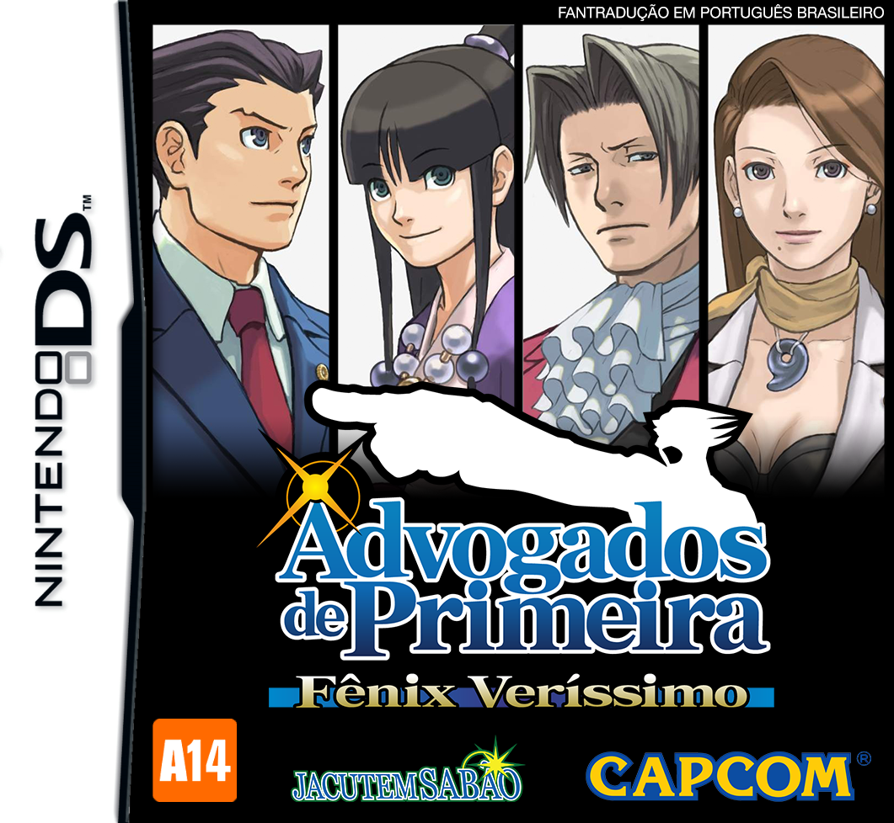

---
circles:
  - jacutem-sabao
title: "Advogados de Primeira: Fênix Veríssimo"
title_type: translation
platforms:
  - ds
date: 2018-07-22
status: complete
origin: en
subs: full
graphics: full
dub: full
credits:
  - author: cronus
    roles:
      - role: collaboration
      - role: translation
  - author: dant
    roles:
      - role: collaboration
  - author: eduardo-viana
    roles:
      - role: collaboration
  - author: marvin
    roles:
      - role: collaboration
  - author: nickhirano
    roles:
      - role: collaboration
      - role: proofreading
      - role: translation
  - author: onepiecefreak
    roles:
      - role: collaboration
  - author: pache
    roles:
      - role: collaboration
  - author: pinet
    roles:
      - role: collaboration
  - author: samuray
    roles:
      - role: collaboration
  - author: shadowg
    roles:
      - role: collaboration
  - author: shagohod
    roles:
      - role: collaboration
  - author: steve-doido
    roles:
      - role: collaboration
  - author: bruno-sigaki
    roles:
      - role: dub
        characters:
          - "Miles Edgeworth"
      - role: translation
  - author: gabriel-andrade
    roles:
      - role: dub
        characters:
          - "Phoenix Wright"
  - author: mamoru-yamane
    roles:
      - role: dub
        characters:
          - "Winston Payne"
  - author: tanekoshima
    roles:
      - role: dub
        characters:
          - "Manfred von Karma"
  - author: bmatsantos
    roles:
      - role: graphics-editing
      - role: proofreading
      - role: translation
  - author: djmatheusito
    roles:
      - role: graphics-editing
      - role: modding
      - role: proofreading
      - role: translation
  - author: emuplays
    roles:
      - role: graphics-editing
  - author: sliter
    roles:
      - role: graphics-editing
  - author: solid-one
    roles:
      - role: graphics-editing
      - role: modding
      - role: proofreading
      - role: translation
  - author: diegohh
    roles:
      - role: modding
  - author: gamerulez
    roles:
      - role: proofreading
      - role: translation
  - author: giovany
    roles:
      - role: proofreading
  - author: kit
    roles:
      - role: proofreading
  - author: magalicia
    roles:
      - role: proofreading
      - role: translation
  - author: rafael-andrade
    roles:
      - role: proofreading
  - author: sahgo
    roles:
      - role: proofreading
      - role: translation
  - author: binario
    roles:
      - role: translation
  - author: joker
    roles:
      - role: translation
  - author: sorinha-phantasie
    roles:
      - role: translation
downloads:
  - platform: ds
    provider: "MEGA"
    format: "xdelta"
    filesize: "3,3 MB"
    version: "1.1"
    gameversion: "1.0"
    region: usa
    status: complete
    completion: 100
    date: 2019-03-10
    url: "https://mega.nz/#!spUBxKCR!RpCzHlN4a7jK85hz0FdWtmTKMjFlVgF7qIqNH24DxJA"
    sha256: "ecb27573916b64d460994ea9bfe65d65b0cc56d6617c790876c593d1f0b8ad7f"
    install: xdelta
  - platform: ds
    type: mirror
    provider: "Google Drive"
    format: "xdelta"
    filesize: "3,3 MB"
    version: "1.1"
    gameversion: "1.0"
    region: usa
    status: complete
    completion: 100
    date: 2019-03-10
    url: "https://drive.google.com/file/d/1jhK-AR1luqn7amWV3WaI0UnyysHampyl"
    sha256: "ecb27573916b64d460994ea9bfe65d65b0cc56d6617c790876c593d1f0b8ad7f"
    install: xdelta
links:
  - label: "Post de Lançamento no Romhacking.net.br"
    url: "https://www.romhacking.net.br/index.php?topic=427.0"
progress:
  - label: "Episódio 1"
    value: 100
  - label: "Episódio 2"
    value: 100
  - label: "Episódio 3"
    value: 100
  - label: "Episódio 4"
    value: 100
  - label: "Episódio 5"
    value: 100
  - label: "Gráficos"
    value: 100
screenshots:
  - "screenapt1.gif"
  - "screenapt2.gif"
  - "screenapt3.gif"
  - "screenapt4.gif"
  - "screenapt5.gif"
  - "screenapt6.gif"
  - "screenapt7.gif"
  - "screenapt8.gif"
---

O jogo engloba diversos nomes com significados importantes e/ou com trocadilhos, com questões de localidades reais, culturais reais, entre outras coisas que tornam a localização necessária e mais difícil, e é o objetivo deste projeto conseguir adaptar para a realidade brasileira o jogo, caso contrário se perderia a graça do jogo bem como uma coerência no contexto da história, sendo impossível não se adaptar tudo dele.

Destarte, utilizem do wikia da série e entendam as adaptações para melhor compreensão do jogo com base em nossa realidade, cultura e modo de vida. Obrigado!
