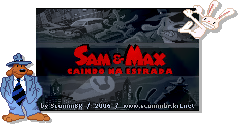

---
circles:
  - scummbr
title: "Sam & Max - Caindo na Estrada"
title_type: translation
platforms:
  - pc
date: 2006-11-25
status: complete
origin: en
subs: full
graphics: partial
dub: none
credits:
  - author: thomas-combeleran
    roles:
      - role: special-thanks
  - author: diego-dj-souza
    roles:
      - role: documentation
      - role: proofreading
      - role: translation
  - author: rafaelgc
    roles:
      - role: documentation
      - role: proofreading
      - role: support
  - author: jinn
    roles:
      - role: graphics-editing
      - role: proofreading
      - role: support
downloads:
  - platform: pc
    provider: "Google Drive"
    format: "Instalador"
    filesize: "358 KB"
    version: "1.0"
    gameversion: "1.0"
    region: global
    status: complete
    completion: 100
    date: 2006-11-25
    url: "https://drive.google.com/file/d/1E9cY-NKJNXuuQd5KxRV0Bwr0LzA6xU5m/view"
    sha256: "3842a29342f1d2fd19630e19926a3c848f24687100bc9ce4e773044a4d1d837c"
    install_custom:
      - "Antes de começar é preciso ter no seu computador o programa SCUMMVM já instalado."
      - "Em primeiro lugar, copie todos os arquivos do CD do jogo SAM & MAX HIT THE ROAD para uma pasta qualquer (Ex: C:\\SAM)."
      - "Agora execute o arquivo em anexo - o instalador do patch de tradução - e siga as instruções que irão aparecer na sua tela."
      - "Após concluída a instalação, rode o programa ScummVM e adicione o jogo SAM & MAX HIT THE ROAD à lista."
      - "Antes de iniciar a jogar SAM & MAX HIT THE ROAD, selecione o nome do jogo com um clique simples do mouse, em seguida clique em \"EDIT GAME\". Agora clique em \"GRAPHICS\". Marque a opção \"OVERRIDE GLOBAL GRAPHIC SETTINGS\" e depois marque \"FULLSCREEN MODE\"."
      - "Clique agora em \"AUDIO\". Marque a opção \"OVERRIDE GLOBAL AUDIO SETTINGS\" e depois, ao lado da expressão \"TEXT AND SPEECH\", selecione a opção \"SPEECH AND SUBTITLES\". Clique em \"OK\", para confirmar."
      - "Agora é só selecionar o jogo SAM & MAX HIT THE ROAD com um clique simples do mouse e clicar em \"START\" para começar a aventura!"
      - "OBS: após a aplicação da tradução, não será mais possível carregar o progresso dos jogos previamente salvos, sendo necessário reiniciar a jogar SAM & MAX HIT THE ROAD desde o princípio e criar novos arquivos para salvar o seu progresso no decorrer do adventure."
      - "Dica especial: ao jogar adventures com o programa ScummVM, se você achar que os textos estão passando muito rápido, tecle F5, clique em \"OPTIONS\" e depois, na opção \"SUBTITLE SPEED\", ajuste a velocidade para \"3\" ou mais, conforme a sua necessidade."
license_custom:
  - "Edições: Proibidas (Sem autorização prévia)"
progress:
  - label: "História Principal"
    value: 100
screenshots:
  - "N43vp.jpg"
  - "Ykcnf.jpg"
  - "zTpv7.jpg"
  - "tYhyh.jpg"
  - "ONpK7.jpg"
  - "ufWGY.jpg"
  - "Z4Yp8.jpg"
  - "SMcSg.jpg"
  - "qcMxr.jpg"
  - "u8Mrm.jpg"
  - "v2HH6.jpg"
  - "f14OS.jpg"
  - "lzEp1.jpg"
  - "EXZIz.jpg"
  - "8VzoC.jpg"
  - "7k5nx.jpg"
  - "i4JZn.jpg"
  - "YR1a6.jpg"
  - "Dt1Q3.jpg"
  - "8vikP.jpg"
  - "CrIWa.jpg"
---

Este é o patch de tradução para português do adventure Sam and Max Hit the Road - e funciona plenamente com a versão CD original do game, com áudio e legendas em inglês. NÃO garantimos o seu funcionamento com outras versões do jogo.
