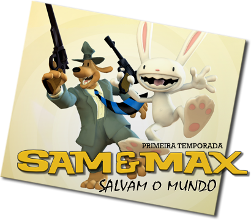

---
circles:
  - scummbr
title: "Sam & Max: Salvam o Mundo"
title_type: translation
platforms:
  - pc
status: hiatus
origin: en
subs: full
graphics: none
dub: none
credits:
  - author: euridice-santos
    roles:
      - role: director
      - role: documentation
      - role: proofreading
      - role: testing
      - role: translation
  - author: rafaelgc
    roles:
      - role: documentation
      - role: graphics-editing
      - role: proofreading
      - role: support
      - role: testing
  - author: guilherme-anjos
    roles:
      - role: proofreading
      - role: testing
  - author: jinn
    roles:
      - role: proofreading
      - role: testing
  - author: matheus-miranda-junior
    roles:
      - role: proofreading
      - role: testing
downloads:
  - platform: pc
    provider: "Google Drive"
    format: "zip"
    filesize: "16,5 MB"
    version: "1.0"
    gameversion: "1.0"
    region: global
    status: hiatus
    completion: 17
    date: 2013-12-25
    url: "https://drive.google.com/file/d/0BxIg7MP84FvHSlVobXN3MWRxVjg/view?usp=sharing&resourcekey=0-WKMXVn-VrNDBxP1eUE8BGw"
    sha256: "d10e8c9454dfd00b58f62868ecf526fa9b9f2e1c8fee93216e76197ace98e673"
    install: pc
  - platform: pc
    provider: "Google Drive"
    variant: "ATUALIZADOR"
    format: "exe"
    filesize: "80,9 MB"
    version: "1.0"
    gameversion: "1.0"
    region: global
    status: hiatus
    completion: 17
    date: 2013-12-25
    url: "https://docs.google.com/file/d/0BxIg7MP84FvHMUVFUmlqcFYxbGs/edit?resourcekey=0-GEjjYU94ymJlf4F0wZeBRw"
    sha256: "15e2fbcf861955ec924ca76e5a242b5c64af652e18175cf5d247c2ae0820a525"
    install: installer
links:
  - label: "Site"
    url: "https://scummbr.org/forum/index.php?topic=461.0"
license_custom:
  - "Edições: Proibidas (Sem autorização prévia)"
progress:
  - label: "Episódio 1"
    value: 100
  - label: "Episódio 2"
    value: 0
  - label: "Episódio 3"
    value: 0
  - label: "Episódio 4"
    value: 0
  - label: "Episódio 5"
    value: 0
  - label: "Episódio 6"
    value: 0
---

Caso a tradução não funcione com a versão do seu jogo, desenvolvemos um patch de atualização chamado **"ATUALIZADOR"**. O procedimento de conversão é muito simples, basta seguir o guia presente no próprio executável que tudo acabará bem.

Estamos lançando essa versão da tradução para que vocês, adventureiros, possam apreciar o trabalho que está sendo feito até então. Nesse patch existem algumas questões importantes a serem abordadas:

- A primeira temporada do jogo é composta de seis capítulos. O presente patch de tradução conta inicialmente com apenas o primeiro, intitulado “CHOQUE CULTURAL”. Os demais serão lançados assim que possível já que nossa equipe não trabalha com datas.
- Até o exato momento não planejamos traduzir as imagens do game pois são fragmentadas em muitos pedaços pequenos, enfim, MUITO trabalho. Mas ainda estamos analisando possibilidade de editá-las.
- Existe um pequeno bug em uma determinada parte do game, que em dado momento do game a personagem Sybil desaparece da tela. Leia a documentação do patch para maiores informações e solução do problema.

(A senha do arquivo é `scummbr.com`)
